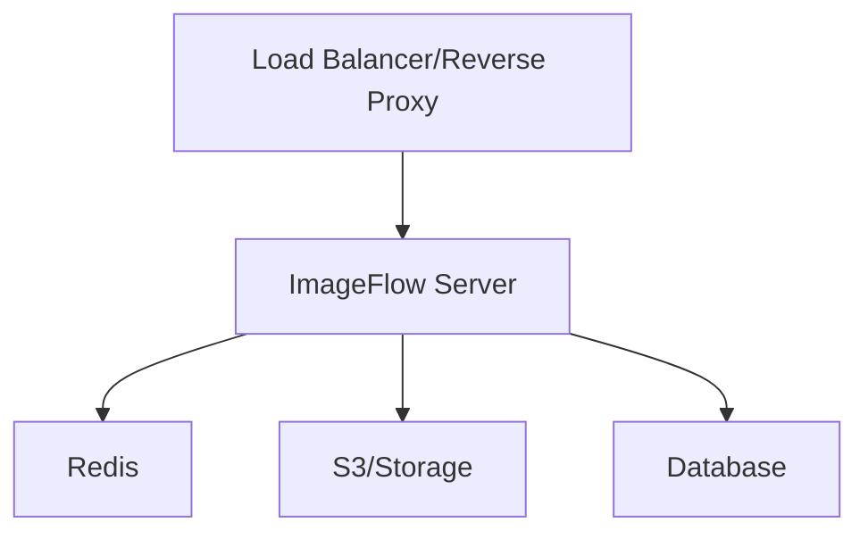
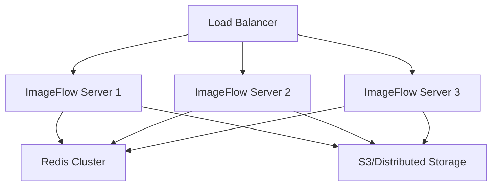
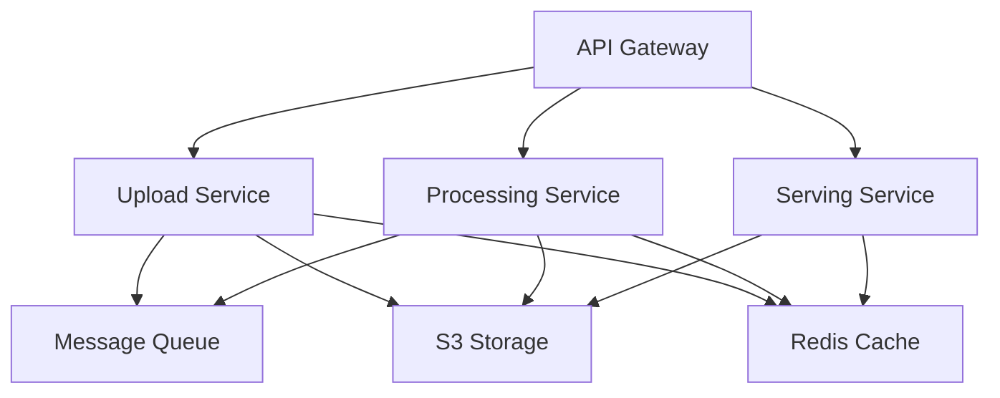

## Production Overview

Deploying ImageFlow to production requires careful consideration of security, performance, scalability, and reliability. This guide covers enterprise-grade deployment strategies and best practices.

<CardGroup cols={2}>
  <Card title="High Availability" icon="shield-check">
    Load balancing, redundancy, and failover strategies
  </Card>
  
  <Card title="Security" icon="lock">
    SSL/TLS, authentication, and access control
  </Card>
  
  <Card title="Performance" icon="zap">
    Caching, CDN integration, and optimization
  </Card>
  
  <Card title="Monitoring" icon="chart-line">
    Logging, metrics, and alerting systems
  </Card>
</CardGroup>

## Architecture Patterns

### Single Server Deployment

Best for: Small to medium applications, development staging



### High Availability Deployment

Best for: Production applications with high uptime requirements



### Microservices Architecture

Best for: Large-scale applications, multiple teams



## Infrastructure Setup

### Cloud Provider Selection

<Tabs>
  <Tab title="AWS">
    **Recommended Services:**
    - **Compute**: ECS Fargate or EKS
    - **Storage**: S3 + CloudFront CDN
    - **Database**: ElastiCache Redis
    - **Load Balancer**: Application Load Balancer
    - **Monitoring**: CloudWatch + X-Ray

    ```yaml
    # docker-compose.aws.yml
    version: '3.8'
    services:
      imageflow:
        image: your-ecr-repo/imageflow:latest
        environment:
          - STORAGE_TYPE=s3
          - S3_BUCKET=${S3_BUCKET}
          - REDIS_HOST=${REDIS_ENDPOINT}
          - API_KEY=${API_KEY}
        deploy:
          replicas: 3
          resources:
            limits:
              memory: 2G
              cpus: '1.0'
    ```
  </Tab>

  <Tab title="Google Cloud">
    **Recommended Services:**
    - **Compute**: Cloud Run or GKE
    - **Storage**: Cloud Storage + Cloud CDN
    - **Database**: Memorystore Redis
    - **Load Balancer**: Cloud Load Balancing
    - **Monitoring**: Cloud Monitoring

    ```yaml
    # Cloud Run deployment
    apiVersion: serving.knative.dev/v1
    kind: Service
    metadata:
      name: imageflow
    spec:
      template:
        metadata:
          annotations:
            autoscaling.knative.dev/maxScale: "10"
            autoscaling.knative.dev/minScale: "2"
        spec:
          containers:
          - image: gcr.io/project/imageflow:latest
            env:
            - name: STORAGE_TYPE
              value: gcs
            - name: GCS_BUCKET
              value: your-bucket
            resources:
              limits:
                memory: "2Gi"
                cpu: "1000m"
    ```
  </Tab>

  <Tab title="Azure">
    **Recommended Services:**
    - **Compute**: Container Instances or AKS
    - **Storage**: Blob Storage + Azure CDN
    - **Database**: Azure Cache for Redis
    - **Load Balancer**: Application Gateway
    - **Monitoring**: Application Insights

    ```yaml
    # Azure Container Instances
    apiVersion: 2019-12-01
    location: eastus
    name: imageflow-group
    properties:
      containers:
      - name: imageflow
        properties:
          image: youracr.azurecr.io/imageflow:latest
          resources:
            requests:
              cpu: 1
              memoryInGb: 2
          environmentVariables:
          - name: STORAGE_TYPE
            value: azure
          - name: AZURE_STORAGE_ACCOUNT
            secureValue: your-storage-account
    ```
  </Tab>

  <Tab title="DigitalOcean">
    **Recommended Services:**
    - **Compute**: App Platform or Kubernetes
    - **Storage**: Spaces + Spaces CDN
    - **Database**: Managed Redis
    - **Load Balancer**: Load Balancer
    - **Monitoring**: Custom setup

    ```yaml
    # DigitalOcean App Platform
    name: imageflow
    services:
    - name: imageflow
      image:
        registry_type: DOCKER_HUB
        repository: your-repo/imageflow
        tag: latest
      instance_count: 2
      instance_size_slug: basic-xxs
      environment_variables:
      - key: STORAGE_TYPE
        value: s3
      - key: S3_ENDPOINT
        value: nyc3.digitaloceanspaces.com
    ```
  </Tab>
</Tabs>

## Security Configuration

### SSL/TLS Setup

<Tabs>
  <Tab title="Nginx Reverse Proxy">
    **nginx.conf:**
    ```nginx
    server {
        listen 80;
        server_name your-domain.com;
        return 301 https://$server_name$request_uri;
    }

    server {
        listen 443 ssl http2;
        server_name your-domain.com;

        # SSL Configuration
        ssl_certificate /etc/ssl/certs/your-domain.crt;
        ssl_certificate_key /etc/ssl/private/your-domain.key;
        ssl_protocols TLSv1.2 TLSv1.3;
        ssl_ciphers ECDHE-RSA-AES256-GCM-SHA512:DHE-RSA-AES256-GCM-SHA512:ECDHE-RSA-AES256-GCM-SHA384;
        ssl_prefer_server_ciphers off;

        # Security Headers
        add_header Strict-Transport-Security "max-age=63072000" always;
        add_header X-Frame-Options DENY;
        add_header X-Content-Type-Options nosniff;
        add_header X-XSS-Protection "1; mode=block";

        # Rate Limiting
        limit_req_zone $binary_remote_addr zone=api:10m rate=10r/s;
        limit_req_zone $binary_remote_addr zone=upload:10m rate=2r/s;

        location /api/upload {
            limit_req zone=upload burst=5 nodelay;
            client_max_body_size 100M;
            
            proxy_pass http://imageflow_backend;
            proxy_set_header Host $host;
            proxy_set_header X-Real-IP $remote_addr;
            proxy_set_header X-Forwarded-For $proxy_add_x_forwarded_for;
            proxy_set_header X-Forwarded-Proto $scheme;
            
            proxy_connect_timeout 60s;
            proxy_send_timeout 60s;
            proxy_read_timeout 120s;
        }

        location /api/ {
            limit_req zone=api burst=20 nodelay;
            
            proxy_pass http://imageflow_backend;
            proxy_set_header Host $host;
            proxy_set_header X-Real-IP $remote_addr;
            proxy_set_header X-Forwarded-For $proxy_add_x_forwarded_for;
            proxy_set_header X-Forwarded-Proto $scheme;
        }

        location / {
            proxy_pass http://imageflow_backend;
            proxy_set_header Host $host;
            proxy_set_header X-Real-IP $remote_addr;
            proxy_set_header X-Forwarded-For $proxy_add_x_forwarded_for;
            proxy_set_header X-Forwarded-Proto $scheme;
        }
    }

    upstream imageflow_backend {
        least_conn;
        server imageflow1:8080 max_fails=3 fail_timeout=30s;
        server imageflow2:8080 max_fails=3 fail_timeout=30s;
        server imageflow3:8080 max_fails=3 fail_timeout=30s;
    }
    ```
  </Tab>

  <Tab title="Traefik">
    **docker-compose.traefik.yml:**
    ```yaml
    version: '3.8'
    
    services:
      traefik:
        image: traefik:v2.9
        command:
          - "--api.dashboard=true"
          - "--providers.docker=true"
          - "--providers.docker.exposedbydefault=false"
          - "--entrypoints.web.address=:80"
          - "--entrypoints.websecure.address=:443"
          - "--certificatesresolvers.letsencrypt.acme.tlschallenge=true"
          - "--certificatesresolvers.letsencrypt.acme.email=admin@yourdomain.com"
          - "--certificatesresolvers.letsencrypt.acme.storage=/letsencrypt/acme.json"
        ports:
          - "80:80"
          - "443:443"
        volumes:
          - "/var/run/docker.sock:/var/run/docker.sock:ro"
          - "./letsencrypt:/letsencrypt"
        
      imageflow:
        image: imageflow:latest
        labels:
          - "traefik.enable=true"
          - "traefik.http.routers.imageflow.rule=Host(\`your-domain.com\`)"
          - "traefik.http.routers.imageflow.entrypoints=websecure"
          - "traefik.http.routers.imageflow.tls.certresolver=letsencrypt"
          - "traefik.http.routers.imageflow.middlewares=rate-limit"
          - "traefik.http.middlewares.rate-limit.ratelimit.burst=100"
        environment:
          - API_KEY=${API_KEY}
          - STORAGE_TYPE=s3
        deploy:
          replicas: 3
    ```
  </Tab>

  <Tab title="Cloudflare">
    **Cloudflare Setup:**
    1. Add your domain to Cloudflare
    2. Update DNS records to point to your server
    3. Enable SSL/TLS encryption mode: "Full (strict)"
    4. Enable security features:

    ```javascript
    // Cloudflare Worker for additional security
    addEventListener('fetch', event => {
      event.respondWith(handleRequest(event.request))
    })

    async function handleRequest(request) {
      const response = await fetch(request)
      
      // Add security headers
      const newHeaders = new Headers(response.headers)
      newHeaders.set('X-Frame-Options', 'DENY')
      newHeaders.set('X-Content-Type-Options', 'nosniff')
      newHeaders.set('Referrer-Policy', 'strict-origin-when-cross-origin')
      
      return new Response(response.body, {
        status: response.status,
        statusText: response.statusText,
        headers: newHeaders
      })
    }
    ```
  </Tab>
</Tabs>

### API Security

```env
# Production security configuration
API_KEY=$(openssl rand -hex 32)

# CORS - restrict to your domains only
CORS_ORIGINS=https://yourdomain.com,https://app.yourdomain.com

# Disable debug mode
DEBUG=false

# Secure Redis
REDIS_PASSWORD=$(openssl rand -hex 16)

# Rate limiting
RATE_LIMIT_ENABLED=true
RATE_LIMIT_REQUESTS=1000
RATE_LIMIT_WINDOW=60

# Request size limits
MAX_FILE_SIZE=10485760      # 10MB
MAX_TOTAL_SIZE=104857600    # 100MB
MAX_UPLOAD_COUNT=20
```

### Network Security

<AccordionGroup>
  <Accordion title="Firewall Configuration">
    ```bash
    # UFW (Ubuntu Firewall)
    sudo ufw default deny incoming
    sudo ufw default allow outgoing

    # Allow SSH (change port if needed)
    sudo ufw allow ssh

    # Allow HTTP/HTTPS
    sudo ufw allow 80/tcp
    sudo ufw allow 443/tcp

    # Allow specific IPs for admin access
    sudo ufw allow from 192.168.1.100 to any port 22

    # Enable firewall
    sudo ufw enable
    ```
  </Accordion>

  <Accordion title="Private Networks">
    ```yaml
    # Docker private network
    version: '3.8'
    
    networks:
      imageflow-internal:
        driver: bridge
        internal: true
      imageflow-external:
        driver: bridge
    
    services:
      imageflow:
        networks:
          - imageflow-external
          - imageflow-internal
      
      redis:
        networks:
          - imageflow-internal  # Only internal access
      
      nginx:
        networks:
          - imageflow-external
        ports:
          - "80:80"
          - "443:443"
    ```
  </Accordion>

  <Accordion title="VPN Access">
    ```bash
    # WireGuard VPN setup for admin access
    sudo apt install wireguard

    # Generate keys
    wg genkey | tee privatekey | wg pubkey > publickey

    # Configure server
    sudo nano /etc/wireguard/wg0.conf
    ```

    ```ini
    [Interface]
    PrivateKey = server-private-key
    Address = 10.0.0.1/24
    ListenPort = 51820

    [Peer]
    PublicKey = client-public-key
    AllowedIPs = 10.0.0.2/32
    ```
  </Accordion>
</AccordionGroup>

## High Availability Setup

### Load Balancing

<Tabs>
  <Tab title="HAProxy">
    **haproxy.cfg:**
    ```
    global
        daemon
        maxconn 4096

    defaults
        mode http
        timeout connect 5000ms
        timeout client 50000ms
        timeout server 50000ms
        option httpchk GET /api/health

    frontend imageflow_frontend
        bind *:80
        bind *:443 ssl crt /etc/ssl/certs/your-domain.pem
        redirect scheme https if !{ ssl_fc }
        
        # Rate limiting
        stick-table type ip size 100k expire 30s store http_req_rate(10s)
        http-request track-sc0 src
        http-request reject if { sc_http_req_rate(0) gt 20 }
        
        default_backend imageflow_backend

    backend imageflow_backend
        balance roundrobin
        option httpchk GET /api/health
        
        server imageflow1 192.168.1.10:8080 check
        server imageflow2 192.168.1.11:8080 check
        server imageflow3 192.168.1.12:8080 check
    ```
  </Tab>

  <Tab title="Kubernetes">
    **imageflow-deployment.yaml:**
    ```yaml
    apiVersion: apps/v1
    kind: Deployment
    metadata:
      name: imageflow
      labels:
        app: imageflow
    spec:
      replicas: 3
      selector:
        matchLabels:
          app: imageflow
      template:
        metadata:
          labels:
            app: imageflow
        spec:
          containers:
          - name: imageflow
            image: imageflow:latest
            ports:
            - containerPort: 8080
            env:
            - name: API_KEY
              valueFrom:
                secretKeyRef:
                  name: imageflow-secrets
                  key: api-key
            - name: REDIS_HOST
              value: "redis-service"
            resources:
              requests:
                memory: "512Mi"
                cpu: "250m"
              limits:
                memory: "2Gi"
                cpu: "1000m"
            livenessProbe:
              httpGet:
                path: /api/health
                port: 8080
              initialDelaySeconds: 30
              periodSeconds: 10
            readinessProbe:
              httpGet:
                path: /api/health
                port: 8080
              initialDelaySeconds: 5
              periodSeconds: 5
    ---
    apiVersion: v1
    kind: Service
    metadata:
      name: imageflow-service
    spec:
      selector:
        app: imageflow
      ports:
      - protocol: TCP
        port: 80
        targetPort: 8080
      type: ClusterIP
    ---
    apiVersion: networking.k8s.io/v1
    kind: Ingress
    metadata:
      name: imageflow-ingress
      annotations:
        kubernetes.io/ingress.class: nginx
        cert-manager.io/cluster-issuer: letsencrypt-prod
        nginx.ingress.kubernetes.io/rate-limit: "100"
    spec:
      tls:
      - hosts:
        - your-domain.com
        secretName: imageflow-tls
      rules:
      - host: your-domain.com
        http:
          paths:
          - path: /
            pathType: Prefix
            backend:
              service:
                name: imageflow-service
                port:
                  number: 80
    ```
  </Tab>
</Tabs>

### Redis High Availability

<Tabs>
  <Tab title="Redis Cluster">
    ```yaml
    version: '3.8'
    
    services:
      redis-1:
        image: redis:7-alpine
        command: redis-server --cluster-enabled yes --cluster-config-file nodes.conf --cluster-node-timeout 5000 --appendonly yes
        ports:
          - "7001:6379"
        volumes:
          - redis-1-data:/data
          
      redis-2:
        image: redis:7-alpine
        command: redis-server --cluster-enabled yes --cluster-config-file nodes.conf --cluster-node-timeout 5000 --appendonly yes
        ports:
          - "7002:6379"
        volumes:
          - redis-2-data:/data
          
      redis-3:
        image: redis:7-alpine
        command: redis-server --cluster-enabled yes --cluster-config-file nodes.conf --cluster-node-timeout 5000 --appendonly yes
        ports:
          - "7003:6379"
        volumes:
          - redis-3-data:/data

    volumes:
      redis-1-data:
      redis-2-data:
      redis-3-data:
    ```

    **Initialize cluster:**
    ```bash
    docker exec redis-1 redis-cli --cluster create \
      redis-1:6379 redis-2:6379 redis-3:6379 \
      --cluster-replicas 0 --cluster-yes
    ```
  </Tab>

  <Tab title="Redis Sentinel">
    ```yaml
    version: '3.8'
    
    services:
      redis-master:
        image: redis:7-alpine
        command: redis-server --appendonly yes
        volumes:
          - redis-master-data:/data
          
      redis-slave-1:
        image: redis:7-alpine
        command: redis-server --slaveof redis-master 6379 --appendonly yes
        volumes:
          - redis-slave-1-data:/data
        depends_on:
          - redis-master
          
      redis-sentinel-1:
        image: redis:7-alpine
        command: redis-sentinel /etc/redis/sentinel.conf
        volumes:
          - ./sentinel.conf:/etc/redis/sentinel.conf
        depends_on:
          - redis-master

    volumes:
      redis-master-data:
      redis-slave-1-data:
    ```

    **sentinel.conf:**
    ```
    sentinel monitor mymaster redis-master 6379 1
    sentinel down-after-milliseconds mymaster 5000
    sentinel parallel-syncs mymaster 1
    sentinel failover-timeout mymaster 10000
    ```
  </Tab>
</Tabs>

## Storage and CDN

### S3 Configuration

```env
# Production S3 settings
STORAGE_TYPE=s3
S3_ENDPOINT=s3.amazonaws.com
S3_REGION=us-east-1
S3_BUCKET=your-prod-imageflow-bucket
S3_ACCESS_KEY=AKIA...
S3_SECRET_KEY=...

# Custom domain for CDN
CUSTOM_DOMAIN=cdn.yourdomain.com
```

### CDN Setup

<Tabs>
  <Tab title="CloudFront">
    ```json
    {
      "DistributionConfig": {
        "CallerReference": "imageflow-cdn",
        "Comment": "ImageFlow CDN Distribution",
        "Origins": {
          "Quantity": 1,
          "Items": [
            {
              "Id": "s3-origin",
              "DomainName": "your-bucket.s3.amazonaws.com",
              "S3OriginConfig": {
                "OriginAccessIdentity": ""
              }
            }
          ]
        },
        "DefaultCacheBehavior": {
          "TargetOriginId": "s3-origin",
          "ViewerProtocolPolicy": "redirect-to-https",
          "CachePolicyId": "cache-policy-id",
          "Compress": true
        },
        "CacheBehaviors": {
          "Quantity": 1,
          "Items": [
            {
              "PathPattern": "*.jpg",
              "TargetOriginId": "s3-origin",
              "CachePolicyId": "image-cache-policy",
              "TTL": 86400
            }
          ]
        },
        "Enabled": true,
        "PriceClass": "PriceClass_100"
      }
    }
    ```
  </Tab>

  <Tab title="Cloudflare">
    ```javascript
    // Cloudflare Workers - Image optimization
    addEventListener('fetch', event => {
      event.respondWith(handleRequest(event.request))
    })

    async function handleRequest(request) {
      const url = new URL(request.url)
      
      // Check if it's an image request
      if (url.pathname.match(/\.(jpg|jpeg|png|webp|avif)$/i)) {
        // Add cache headers
        const response = await fetch(request)
        const newResponse = new Response(response.body, response)
        
        newResponse.headers.set('Cache-Control', 'public, max-age=31536000')
        newResponse.headers.set('X-Content-Type-Options', 'nosniff')
        
        return newResponse
      }
      
      return fetch(request)
    }
    ```
  </Tab>
</Tabs>

## Monitoring and Logging

### Application Monitoring

<Tabs>
  <Tab title="Prometheus + Grafana">
    **docker-compose.monitoring.yml:**
    ```yaml
    version: '3.8'
    
    services:
      prometheus:
        image: prom/prometheus:latest
        ports:
          - "9090:9090"
        volumes:
          - ./prometheus.yml:/etc/prometheus/prometheus.yml
          - prometheus-data:/prometheus
        command:
          - '--config.file=/etc/prometheus/prometheus.yml'
          - '--storage.tsdb.path=/prometheus'
          - '--web.console.libraries=/usr/share/prometheus/console_libraries'
          - '--web.console.templates=/usr/share/prometheus/consoles'
          - '--web.enable-lifecycle'

      grafana:
        image: grafana/grafana:latest
        ports:
          - "3000:3000"
        environment:
          - GF_SECURITY_ADMIN_PASSWORD=admin
        volumes:
          - grafana-data:/var/lib/grafana

      node-exporter:
        image: prom/node-exporter:latest
        ports:
          - "9100:9100"

    volumes:
      prometheus-data:
      grafana-data:
    ```

    **prometheus.yml:**
    ```yaml
    global:
      scrape_interval: 15s

    scrape_configs:
      - job_name: 'imageflow'
        static_configs:
          - targets: ['imageflow:8080']
      
      - job_name: 'node-exporter'
        static_configs:
          - targets: ['node-exporter:9100']
      
      - job_name: 'redis'
        static_configs:
          - targets: ['redis:6379']
    ```
  </Tab>

  <Tab title="ELK Stack">
    **docker-compose.elk.yml:**
    ```yaml
    version: '3.8'
    
    services:
      elasticsearch:
        image: docker.elastic.co/elasticsearch/elasticsearch:8.5.0
        environment:
          - discovery.type=single-node
          - xpack.security.enabled=false
        ports:
          - "9200:9200"
        volumes:
          - elasticsearch-data:/usr/share/elasticsearch/data

      logstash:
        image: docker.elastic.co/logstash/logstash:8.5.0
        volumes:
          - ./logstash.conf:/usr/share/logstash/pipeline/logstash.conf
        depends_on:
          - elasticsearch

      kibana:
        image: docker.elastic.co/kibana/kibana:8.5.0
        ports:
          - "5601:5601"
        environment:
          - ELASTICSEARCH_HOSTS=http://elasticsearch:9200
        depends_on:
          - elasticsearch

    volumes:
      elasticsearch-data:
    ```
  </Tab>
</Tabs>

### Health Checks

```go
// Add to ImageFlow handlers
func HealthCheckHandler(w http.ResponseWriter, r *http.Request) {
    health := map[string]interface{}{
        "status":    "healthy",
        "timestamp": time.Now().Unix(),
        "version":   version,
        "uptime":    time.Since(startTime).Seconds(),
    }

    // Check Redis connection
    if redisEnabled {
        if err := redisClient.Ping().Err(); err != nil {
            health["redis"] = "unhealthy"
            health["status"] = "degraded"
        } else {
            health["redis"] = "healthy"
        }
    }

    // Check storage
    if err := checkStorage(); err != nil {
        health["storage"] = "unhealthy"
        health["status"] = "degraded"
    } else {
        health["storage"] = "healthy"
    }

    w.Header().Set("Content-Type", "application/json")
    if health["status"] == "unhealthy" {
        w.WriteHeader(http.StatusServiceUnavailable)
    }
    json.NewEncoder(w).Encode(health)
}
```

## Deployment Automation

### CI/CD Pipeline

<Tabs>
  <Tab title="GitHub Actions">
    **.github/workflows/deploy.yml:**
    ```yaml
    name: Deploy to Production

    on:
      push:
        tags:
          - 'v*'

    jobs:
      test:
        runs-on: ubuntu-latest
        steps:
        - uses: actions/checkout@v3
        - uses: actions/setup-go@v3
          with:
            go-version: '1.23'
        - run: go test ./...

      build:
        needs: test
        runs-on: ubuntu-latest
        steps:
        - uses: actions/checkout@v3
        
        - name: Build Docker image
          run: |
            docker build -t imageflow:${{ github.ref_name }} .
            docker tag imageflow:${{ github.ref_name }} imageflow:latest
        
        - name: Push to registry
          run: |
            echo ${{ secrets.DOCKER_PASSWORD }} | docker login -u ${{ secrets.DOCKER_USERNAME }} --password-stdin
            docker push imageflow:${{ github.ref_name }}
            docker push imageflow:latest

      deploy:
        needs: build
        runs-on: ubuntu-latest
        steps:
        - name: Deploy to production
          uses: appleboy/ssh-action@v0.1.5
          with:
            host: ${{ secrets.HOST }}
            username: ${{ secrets.USERNAME }}
            key: ${{ secrets.SSH_KEY }}
            script: |
              cd /opt/imageflow
              docker-compose pull
              docker-compose up -d --remove-orphans
              docker system prune -f
    ```
  </Tab>

  <Tab title="GitLab CI">
    **.gitlab-ci.yml:**
    ```yaml
    stages:
      - test
      - build
      - deploy

    variables:
      DOCKER_IMAGE: $CI_REGISTRY_IMAGE
      DOCKER_TAG: $CI_COMMIT_TAG

    test:
      stage: test
      image: golang:1.23
      script:
        - go mod download
        - go test ./...

    build:
      stage: build
      image: docker:latest
      services:
        - docker:dind
      script:
        - docker build -t $DOCKER_IMAGE:$DOCKER_TAG .
        - docker login -u $CI_REGISTRY_USER -p $CI_REGISTRY_PASSWORD $CI_REGISTRY
        - docker push $DOCKER_IMAGE:$DOCKER_TAG

    deploy:
      stage: deploy
      image: alpine:latest
      before_script:
        - apk add --no-cache openssh-client
        - eval $(ssh-agent -s)
        - echo "$SSH_PRIVATE_KEY" | tr -d '\r' | ssh-add -
      script:
        - ssh -o StrictHostKeyChecking=no $DEPLOY_USER@$DEPLOY_HOST "cd /opt/imageflow && docker-compose pull && docker-compose up -d"
      only:
        - tags
    ```
  </Tab>
</Tabs>

### Blue-Green Deployment

```bash
#!/bin/bash
# deploy-blue-green.sh

set -e

BLUE_COMPOSE="docker-compose.blue.yml"
GREEN_COMPOSE="docker-compose.green.yml"
NGINX_COMPOSE="docker-compose.nginx.yml"

# Determine current environment
CURRENT=$(curl -s http://localhost/api/health | jq -r '.environment // "blue"')

if [ "$CURRENT" = "blue" ]; then
    NEW_ENV="green"
    NEW_COMPOSE=$GREEN_COMPOSE
    OLD_COMPOSE=$BLUE_COMPOSE
else
    NEW_ENV="blue"
    NEW_COMPOSE=$BLUE_COMPOSE
    OLD_COMPOSE=$GREEN_COMPOSE
fi

echo "Deploying to $NEW_ENV environment..."

# Deploy new environment
docker-compose -f $NEW_COMPOSE pull
docker-compose -f $NEW_COMPOSE up -d

# Wait for health check
echo "Waiting for health check..."
for i in {1..30}; do
    if curl -f http://localhost:8081/api/health; then
        echo "Health check passed"
        break
    fi
    if [ $i -eq 30 ]; then
        echo "Health check failed, rolling back"
        docker-compose -f $NEW_COMPOSE down
        exit 1
    fi
    sleep 10
done

# Switch traffic
echo "Switching traffic to $NEW_ENV..."
sed -i "s/imageflow-[a-z]*/imageflow-$NEW_ENV/g" nginx/nginx.conf
docker-compose -f $NGINX_COMPOSE exec nginx nginx -s reload

# Verify traffic switch
sleep 10
if curl -s http://localhost/api/health | grep -q "\"environment\":\"$NEW_ENV\""; then
    echo "Traffic successfully switched to $NEW_ENV"
    
    # Shutdown old environment
    echo "Shutting down old environment..."
    docker-compose -f $OLD_COMPOSE down
    
    echo "Deployment completed successfully"
else
    echo "Traffic switch failed, rolling back"
    sed -i "s/imageflow-$NEW_ENV/imageflow-$([ "$NEW_ENV" = "blue" ] && echo "green" || echo "blue")/g" nginx/nginx.conf
    docker-compose -f $NGINX_COMPOSE exec nginx nginx -s reload
    docker-compose -f $NEW_COMPOSE down
    exit 1
fi
```

## Performance Optimization

### Caching Strategy

```env
# Redis caching configuration
REDIS_CACHE_TTL=3600           # 1 hour
REDIS_CACHE_MAX_MEMORY=1gb
REDIS_CACHE_POLICY=allkeys-lru

# HTTP caching headers
CACHE_CONTROL_MAX_AGE=31536000  # 1 year for images
CACHE_CONTROL_MUST_REVALIDATE=true
```

### Database Optimization

```redis
# Redis production configuration
# redis-prod.conf

# Memory optimization
maxmemory 2gb
maxmemory-policy allkeys-lru
maxmemory-samples 5

# Persistence optimization
save 900 1
save 300 10
save 60 10000

# Network optimization
tcp-keepalive 300
timeout 0

# Logging
loglevel notice
syslog-enabled yes
syslog-ident redis
```

## Backup and Disaster Recovery

### Automated Backup

```bash
#!/bin/bash
# backup-prod.sh

BACKUP_DIR="/backup/imageflow/$(date +%Y%m%d)"
S3_BACKUP_BUCKET="your-backup-bucket"

mkdir -p $BACKUP_DIR

# Backup Redis
docker exec redis-prod redis-cli BGSAVE
docker cp redis-prod:/data/dump.rdb $BACKUP_DIR/redis-dump.rdb

# Backup configuration
cp -r /opt/imageflow/{.env,docker-compose*.yml,nginx.conf} $BACKUP_DIR/

# Upload to S3
aws s3 cp $BACKUP_DIR/ s3://$S3_BACKUP_BUCKET/$(date +%Y%m%d)/ --recursive

# Clean old backups (keep 30 days)
find /backup/imageflow -type d -mtime +30 -exec rm -rf {} \;

# Verify backup
if aws s3 ls s3://$S3_BACKUP_BUCKET/$(date +%Y%m%d)/ > /dev/null; then
    echo "Backup completed successfully"
else
    echo "Backup failed!" | mail -s "ImageFlow Backup Failed" admin@yourdomain.com
fi
```

### Disaster Recovery

```bash
#!/bin/bash
# disaster-recovery.sh

BACKUP_DATE=${1:-$(date +%Y%m%d)}
BACKUP_BUCKET="your-backup-bucket"
RESTORE_DIR="/opt/imageflow-restore"

echo "Starting disaster recovery for $BACKUP_DATE..."

# Download backup
aws s3 cp s3://$BACKUP_BUCKET/$BACKUP_DATE/ $RESTORE_DIR/ --recursive

# Stop services
docker-compose down

# Restore configuration
cp $RESTORE_DIR/*.yml $RESTORE_DIR/.env ./

# Restore Redis data
docker volume rm redis-data
docker volume create redis-data
docker run --rm -v redis-data:/data -v $RESTORE_DIR:/backup alpine cp /backup/redis-dump.rdb /data/

# Start services
docker-compose up -d

echo "Disaster recovery completed"
```

## Next Steps

<CardGroup cols={2}>
  <Card title="Monitoring Setup" icon="chart-line" href="/deployment/monitoring">
    Set up comprehensive monitoring and alerting
  </Card>
  
  <Card title="Performance Tuning" icon="gauge" href="/deployment/performance">
    Optimize ImageFlow for maximum performance
  </Card>
  
  <Card title="Security Hardening" icon="shield" href="/deployment/security">
    Advanced security configuration
  </Card>
  
  <Card title="Scaling Guide" icon="expand" href="/deployment/scaling">
    Scale ImageFlow for high traffic loads
  </Card>
</CardGroup>